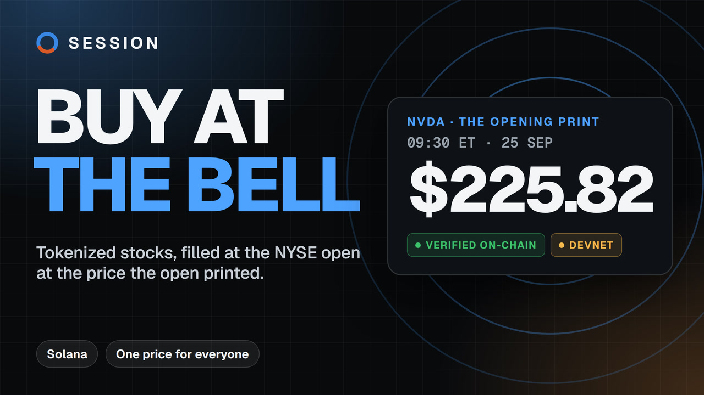

# SESSION

**Bell orders for tokenized stocks.** Place a buy or sell at any hour, and it
fills at the NYSE open or close, at the price the bell printed, verified on
Solana. Everyone in the bell gets the same price.

[](https://youtu.be/fOLXfgxa3xg)

**[Watch the pitch](https://youtu.be/fOLXfgxa3xg)** ·
**[Try it on devnet](https://session-roan.vercel.app/bells)** ·
**[The receipt from the 25 Sep open](https://session-roan.vercel.app/b/GdN6aYz68FBYxmwjVVUbJ9PEXrsku5nsDj7S18uX7PAb)** ·
**[Every print, verified](https://session-roan.vercel.app/oracle)**

Built for [STOCKLANA](https://hackathons.solana.com/hackathons/stocklana).
Sponsor tracks: Pyth, PreStocks and Clawpump ([why these three](docs/BOUNTIES.md)).
Sixty seconds, in the order that lets you check it: [`docs/JUDGE.md`](docs/JUDGE.md).

---

## The problem

NVIDIA's price is made on Nasdaq for 6.5 hours a day. NVDAx trades on Solana
for all 168 hours of the week, and most of that trading happens while the price
isn't being made. Those are the hours pools are thinnest, and drift furthest
from the real price:

| | |
|---|---|
| Tokenized-equity volume outside US market hours | **63%** (Solana Foundation newsletter; Crypto Briefing, through Aug 2026) |
| Median pool deviation from Pyth's first price back, weekend against weekday | **22–31 bp** against **2.7–3.5 bp** (bozBasket, 18–20 Sep 2026) |
| A $10k round trip, even during market hours | SPYx 3.0 bp · NVDAx 9.9 · AAPLx 57.6 · METAx 126.4 (Haircut, 14 Sep 2026) |
| US daily volume crossed in the closing auction alone | **8–15%** (NYSE, BMLL) |

Wall Street's answer to a thin book is the auction at the bell, where everyone
trades at one price. Tokenized stocks have no opening auction and no closing
auction.

**The user.** Ade is in Lagos. On Saturday night she wants $200 of NVIDIA at
Monday's open, and at 09:30 ET she'll be asleep. Today her only choice is a
thin weekend pool. With SESSION she places the order now, and it fills at the
open's own price, the same price as everyone else in that bell.

## Try it

1. **[/bells](https://session-roan.vercel.app/bells)**, with no wallet: the next open and close, the NVDAx book, and the ticket, with "Now, on Jupiter" beside "At the bell".
2. **[The receipt from the 25 Sep open](https://session-roan.vercel.app/b/GdN6aYz68FBYxmwjVVUbJ9PEXrsku5nsDj7S18uX7PAb)**: the print, its signature checked again in your browser, the fills, the fee, and Jupiter's quote at the bell beside them.
3. **Place one.** Connect a devnet wallet, take test funds from the faucet on the page, and order for the next real bell. The keepers run on Railway, so the bell is posted, and your order fills and settles, whether or not anyone here is awake. Its receipt appears once the bell clears.
4. **[/oracle](https://session-roan.vercel.app/oracle)**: every open and close recorded, each linked to the transaction that verified it.

## How it works

```
 Pyth Lazer message ──► session-bell ──► final print: immutable, readable by any program
 (Ed25519-signed)       the oracle                  │
                        holds no funds              ▼
 the site ─┐                                  session-cross ──────► receipt, /b/<cross>
 a Blink  ─┼─ place_order, escrowed ────────► the exchange          print re-verified,
 agents   ─┘  any time until 2 min before     escrow, price, net,   fills, fee, escrow,
                                              auction, settle       Jupiter's quote beside
 keeper ────────── permissionless cranks ───►
 backstop maker ── standing offer at 15 bp ─►
```

Both programs share `crates/session-core`, the NYSE calendar and the
arithmetic, in pure Rust with no dependencies.

### session-bell, the oracle

- One print per listing per bell: the 09:30 open and the 16:00 close (13:00 on half-days), for NVDA, SPY, TSLA, AAPL and QQQ.
- A post is one transaction. Solana's Ed25519 precompile checks the Pyth Lazer signature. `post_print` then hands the message to Pyth's verifier by CPI, which checks that the signer is trusted and unexpired, and parses every byte itself.
- Rule v1 ([`docs/METHOD.md`](docs/METHOD.md)) accepts a price only if it passes all of these:
  - it comes from the regular session;
  - its confidence is within 25 bp;
  - it falls inside the window around the bell;
  - it strictly improves on the stored print, which means a later close or an earlier open;
  - its feed is dated no more than 120 s past the chain's clock.
- At the deadline the print freezes. Anyone may then finalise it, or mark the bell missing. Neither can be undone.
- It stores prices and holds no funds. The byte layout, and how to check a print yourself, are in [`docs/BELL.md`](docs/BELL.md).

### session-cross, the exchange

- `place_order` escrows USDC to buy or raw xStock to sell, with an optional limit on the *share* price. An order can be cancelled until the freeze, 2 minutes before the bell.
- `price_cross` prices one raw token at **the print × the mint's own Token-2022 scaled-UI multiplier**, read from the mint at the bell. Two things cancel the cross instead of letting it guess: a multiplier activation within 15 minutes of the bell, or a disagreement with Pyth's `.RR` feed.
- Buyers and sellers **net against each other at that one price, with no fee**. Only the imbalance goes to makers, in a 2-minute uniform-price auction on a 101-step fee ladder, from 0 to 100 bp:
  - the clearing fee is the lowest ask that covers the need;
  - the marginal bucket is rationed;
  - a backstop maker's standing 15 bp offer caps the fee.
- Settlement is per leg, permissionless and batched. An issuer pause can hold tokens, but it can never block a USDC refund.
- A missing print, or no final print within 6 hours, cancels the cross and refunds everyone whole.
- Rounding favours the escrow. What an order gives up rounds up, and what it receives rounds down. The program asserts `paid out + refunded ≤ escrowed` on every settlement. The full specification is [`docs/CROSS.md`](docs/CROSS.md).

### The receipt, and the swap beside it

Every cross has a page at `/b/<cross>`, read from the chain on each visit. It shows:

- **The print.** The receipt fetches the transaction that posted it and re-verifies its Ed25519 signature in the browser, over the bytes the program parsed. It then compares the signed feed with the stored print, field by field.
- **The cross, step by step:** frozen, priced, auction, cleared, settled. With it come both sides' totals, the crowded side and its fee, and the escrow in and out.
- **The counterfactual.** At the bell the keeper quotes each side's total on Jupiter, for the real NVDAx on mainnet, and writes the quote as a Memo *inside the `price_cross` transaction*. The receipt shows it only from that transaction, and only if the keeper named in the manifest signed it. Without it, the receipt claims no saving.

### Three ways in

- **The site.** `/bells` is the ticket and the book.
- **A Blink.** `/api/bell-action` is a Solana Action, and `actions.json` maps `/bells` to it. It checks the wallet's balance before handing over a transaction to sign, holds no key, and caps an order at $1,000 or 5 NVDAx.
- **Agents.** Five MCP tools (`npm run mcp`): `bell_status`, `bell_quote`, `bell_receipt`, `bell_place_order` and `bell_cancel_order`. The two that write are capped per order in code, and they refuse mainnet unless `SESSION_ALLOW_MAINNET=1`.

## The first real bell: the 25 September 2026 open

This ran on devnet at the real NYSE open, with the keeper and the backstop maker unattended.

| Step | What happened | On chain |
|---|---|---|
| Prints | All five listings posted and finalised. NVDA opened at **$225.82**, 16 s after 09:30 ET | [NVDA's post](https://explorer.solana.com/tx/4MyY1CX6q3GFESBhysCTdqSqP1nH1sN2g6d1boKDdRbqWBWJPaGdfgT5jQ8PPdBS58rG9cmKVUdnw7byvDgd1EA6?cluster=devnet) |
| Priced | At 13:40:24 UTC, with the counterfactual memo in the same transaction | [`price_cross`](https://explorer.solana.com/tx/3M2EkG2pG4Pqimx7zUrq93BfSJaZsQsEEatipEJ9WygpanAxNWuXsZzi8RDVaBbKv6VkQ5UF9aK25zdfQcKVG3cx?cluster=devnet) |
| Cleared | Buyers were crowded, and the 15 bp backstop filled the imbalance | [`clear`](https://explorer.solana.com/tx/3Aq2mdLyS3etwX5vyh27o8XSLrmYNuNH6jWVCdvDo6945kFsiU2hBFNDmqBMbQ3JMYHKZE22rG4MJ7U49esYoV34?cluster=devnet) |
| Settled | 4 test orders and the maker's offer. Buyers paid $1,205 for 5.3326 NVDAx. Sellers sold 3.0051 NVDAx for $678.61 | [the receipt](https://session-roan.vercel.app/b/GdN6aYz68FBYxmwjVVUbJ9PEXrsku5nsDj7S18uX7PAb) |
| Against Jupiter, 09:30:03 ET | Sellers got **37.16 bp more** per token, and buyers **33.99 bp less** per dollar. The pool was cheaper than the stock that morning, and the receipt says so | the memo, above |
| Pause drill | The mint was paused before the open. The cross priced and cleared anyway, each quote leg was paid alone, and the tokens settled after the resume. Escrow ended at 0 / 0 | [`cross-drills.json`](web/public/cross-drills.json) |
| Multiplier drill | Multiplier 1.0025 was scheduled for 5 minutes after the bell. `price_cross` cancelled, and everyone was refunded whole. Escrow ended at 0 | [`docs/CROSS.md`](docs/CROSS.md#issuer-power-drills-on-devnet) |

## Why Solana

- **Verification in the same transaction.** The Ed25519 precompile checks Pyth's signature inside the transaction that stores the price. Nothing can happen between "verified" and "used".
- **The token defines its own price.** Token-2022's scaled-UI extension puts each xStock's multiplier on chain, so the cross reads what a raw token is worth instead of assuming it.
- **One price, many orders, cheaply.** A whole bell settles in permissionless transactions that cost a fraction of a cent each.
- **It is where tokenized stocks are.** Solana has 1,000,000+ holders, and 85–95% of on-chain tokenized-equity activity (Crypto Briefing and Solana Compass, Sep 2026). Blinks and MCP put the order where those holders already are.

## Tested

| What | How | Result |
|---|---|---|
| The arithmetic | Property tests over `crates/session-core/src/cross.rs` (listed below the table) | 10,000 cases per property |
| The oracle, end to end | LiteSVM with **Pyth's real mainnet Lazer verifier binary** (`tests/integration/fetch.sh`) | 19 / 19 |
| The exchange, end to end | LiteSVM on the **real NVDAx mint**, captured from mainnet at its real address, with Pyth-verified prints (cases below the table) | 9 / 9 |
| The exchange, randomised | `cross_fuzz.rs`: random prices, 1–5 buyers and 1–5 sellers with random limits, 0–3 makers, one cross per trading day across DST changes, holidays and a year boundary. Every balance must equal the math to the atom | 300 crosses |
| Rust and TypeScript agree | Shared vectors: the SDK decodes the very bytes the Rust wrote | `tests/vectors` |
| The SDK | 15 TypeScript suites, among them cross instructions (71), receipts (35) and the counterfactual (31) | all pass |
| The site against devnet | `web/scripts/bells-flow.mjs`: a fresh wallet places and cancels real orders through `/bells`, and each is checked against the chain to the atom | 41 / 41 |
| Agents and the Blink | `npm run mcp:check` and `npm run actions` drive every tool and the Action as a client would | 20 / 20, 21 / 21 |

The property tests assert that:
- value is conserved;
- no order gives up more than it escrowed;
- the uncrowded side trades at exactly X;
- more capacity never raises the fee.

The exchange's LiteSVM cases are: a full cross, crowded sellers, a missing print, the freeze, an issuer pause, a multiplier change, and a `.RR` disagreement.

```bash
npm install            # once, at the root (a workspace; it installs the site too)
npm test               # eligibility, the Rust tests, the TypeScript suites
(cd tests/integration && ./fetch.sh && cargo test)                    # LiteSVM, Pyth's own verifier
(cd tests/integration && CROSS_FUZZ=300 cargo test --test cross_fuzz) # the fuzzer
cd web && npm run verify                                               # the site, against devnet
```

## What is real, and what is not

| | Status |
|---|---|
| `session-bell`, `session-cross` | Deployed on **devnet**. Mainnet comes after an audit |
| Prints | **Simulated** on devnet, because SESSION has no Pyth Pro key yet:<br>• signed by a test key that a rebuild of Pyth's own verifier trusts ([`tools/lazer-devnet`](tools/lazer-devnet/README.md));<br>• priced from Jupiter's stock data;<br>• flagged `simulated` by the program, permanently, with every page saying so first.<br>Pointing `set_verifier` at Pyth's program is the whole switch |
| NVDAx and USDC | Devnet **fixtures**. The NVDAx fixture is a Token-2022 mint with the real one's extensions and multiplier bits |
| The counterfactual | **Real**: mainnet Jupiter quotes for the real NVDAx, taken at the bell |
| `$BELL` | **Mainnet**, launched through Clawpump and quoted in real NVDAx ([Solscan](https://solscan.io/token/7z9y4P3yatZki2AHHtzjPxEhjVTP1d362BQH1kDPdQTe)) |
| The keeper and the backstop maker | Running on Railway ([`deploy/railway`](deploy/railway/deploy.sh)) with labelled team keys. Every crank is permissionless, so a late or absent keeper causes delay, never loss |
| Orders in the demo crosses | From the team's labelled test traders (`npm run cross:demo`) |

**Next:**
1. The Pyth Pro key.
2. An external audit.
3. Mainnet, with caps.
4. Recurring bell orders ("$50 of SPY at every Monday open") and skip-the-weekend.

## Deployments

| | Address |
|---|---|
| `session-bell`, devnet | [`BeLLKXJwhSH6YXYQLc8xLd11GxJUvoaT1h9zCadymJv4`](https://explorer.solana.com/address/BeLLKXJwhSH6YXYQLc8xLd11GxJUvoaT1h9zCadymJv4?cluster=devnet) |
| `session-cross`, devnet | [`Crosf1CpgcEs6G6SiX2B7KMR4hxVcE2FGU2r53a3RK9K`](https://explorer.solana.com/address/Crosf1CpgcEs6G6SiX2B7KMR4hxVcE2FGU2r53a3RK9K?cluster=devnet) |
| Pyth's Lazer verifier, rebuilt for the test signer, devnet | [`CVuKQFLc1PAuJ8y7kPckw8Hi8W6WhdeWrhM9UBVdm2qs`](https://explorer.solana.com/address/CVuKQFLc1PAuJ8y7kPckw8Hi8W6WhdeWrhM9UBVdm2qs?cluster=devnet) |
| The NVDA market, devnet | [`AYmob34FzFRo9kVBZA18jfcRSJJQfgpDKr7Kzc5FZJmb`](https://explorer.solana.com/address/AYmob34FzFRo9kVBZA18jfcRSJJQfgpDKr7Kzc5FZJmb?cluster=devnet) |
| Fixture NVDAx, devnet | [`FFMzfSf29q3DhT1a6smNYBZuNUfscsgTu59351tvHdvg`](https://explorer.solana.com/address/FFMzfSf29q3DhT1a6smNYBZuNUfscsgTu59351tvHdvg?cluster=devnet) |
| `$BELL`, mainnet | [`7z9y4P3yatZki2AHHtzjPxEhjVTP1d362BQH1kDPdQTe`](https://solscan.io/token/7z9y4P3yatZki2AHHtzjPxEhjVTP1d362BQH1kDPdQTe) |
| The first program, DAY and NIGHT, devnet | [`8gWC37AFvgnPMAZSqiimbkpqPVhF3PrA1rao5agVKqKZ`](https://explorer.solana.com/address/8gWC37AFvgnPMAZSqiimbkpqPVhF3PrA1rao5agVKqKZ?cluster=devnet) |

## Where it started: DAY and NIGHT

SESSION's first program splits a tokenized stock into `X.DAY`, the hours its
price is made, and `X.NIGHT`, the hours it is not. It is still live on devnet
and still settles, with two vaults:
- **An equity vault on NYSE hours.**
- **An event vault on a PreStocks-shaped OPENAI.** It has no clock, and its boundary is the live mark and executable price read from prestocks.com.

The research behind it measured 83,322 hourly closes across 26 tokenized
assets. It found no overnight premium. It found instead that the night carries
46% more volatility, and pays nothing extra for it. That is where tokenized
stocks trade, and where they are least anchored to the real price, which is
how the project arrived at the bell.

The program, the study and its method are in
[`docs/DAY-NIGHT.md`](docs/DAY-NIGHT.md) and on
[/research](https://session-roan.vercel.app/research).

## Repository

```
programs/session-bell/     the bell oracle: Pyth Lazer posts, rule v1, final prints
programs/session-cross/    bell orders: escrow, pricing, the auction, settlement
programs/session/          the first program: DAY and NIGHT vaults
crates/session-core/       shared by every program, no dependencies
  calendar.rs              NYSE sessions: DST, holidays, half-days, computus
  cross.rs                 netting and the uniform-price auction, pure, property-tested
  xstock.rs                what a raw xStock atom is worth, read from the mint
  fixed.rs                 256-bit mul_div, WAD fixed point
sdk/src/                   instruction builders, decoders, the receipt reader, the counterfactual
keeper/src/                the bell poster, the cross keeper, the drills, devnet setup
agent/                     the MCP server, its check, and the $BELL launcher
web/                       the site (Vite + React) and its serverless functions (the Blink, the faucet)
tests/integration/         LiteSVM: Pyth's verifier binary, the real NVDAx mint, the fuzzer
tests/                     TypeScript suites and the cross-language vectors
tools/lazer-devnet/        Pyth's verifier under a devnet id, for the test signer
deploy/                    the keepers as systemd units, or on Railway
research/                  the session study, bad-print rejection, execution costs
docs/                      the specifications, the runbook, the audit, the key policy
```

## Documents

- [`docs/JUDGE.md`](docs/JUDGE.md): sixty seconds, the claim and its evidence, and what is not real yet.
- [`docs/BELL.md`](docs/BELL.md): the oracle, byte by byte.
- [`docs/METHOD.md`](docs/METHOD.md): which price is the open, and which is the close.
- [`docs/CROSS.md`](docs/CROSS.md): the exchange, its arithmetic, the receipt, the Blink and the drills.
- [`docs/OPERATIONS.md`](docs/OPERATIONS.md): the runbook, including the keepers on Railway.
- [`docs/BOUNTIES.md`](docs/BOUNTIES.md): the three sponsor tracks, and the two left out.
- [`docs/UPGRADE-POLICY.md`](docs/UPGRADE-POLICY.md): who holds which key, and what it can do.
- [`docs/AUDIT.md`](docs/AUDIT.md): the adversarial record, including the findings that turned out to be wrong.
- [`docs/DAY-NIGHT.md`](docs/DAY-NIGHT.md): the first program and the research.

Not investment advice. Not offered to US persons. Devnet figures are test funds.
